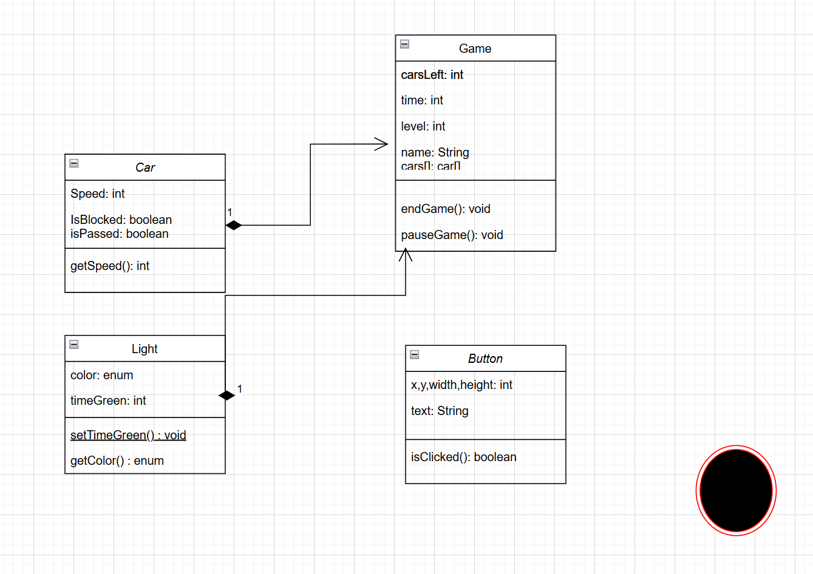

# Traffic-Simulator

This application is a traffic simulator and puzzle regarding minimizing traffic. The user will have the ability to change traffic light patterns and timings in order to optimize traffic flow. The game will have a time element and different levels with different numbers of intersenctions. This project uses csv tables to store levels and files to store high scores for each level.
something with in a jam

urinals??!!!
